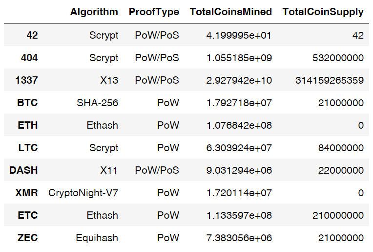
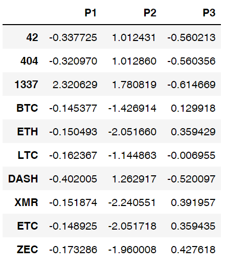
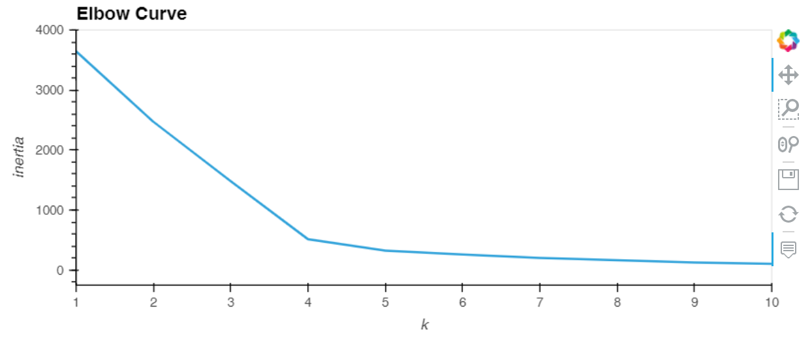
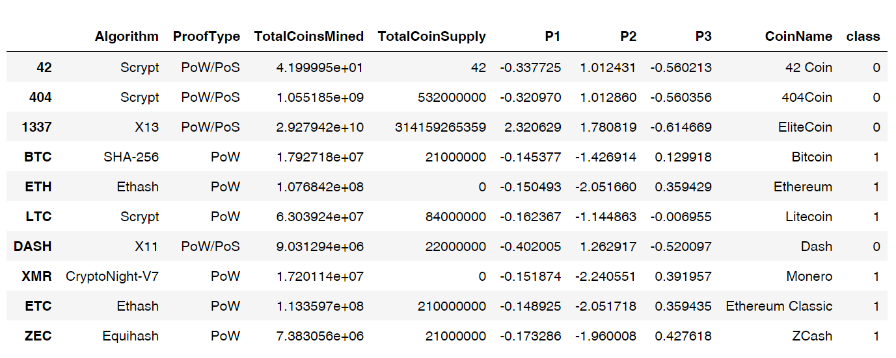
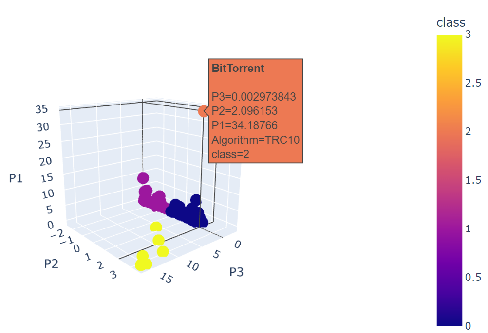
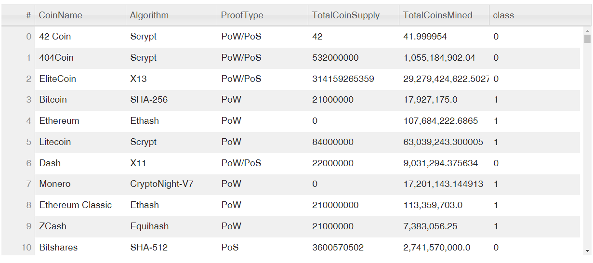
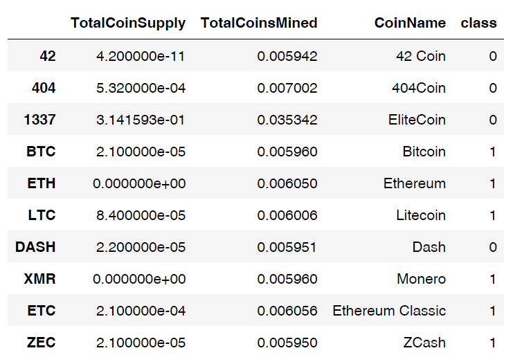
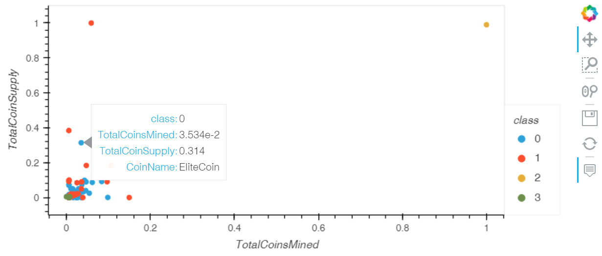

# Cryptocurrencies

## 1 Purpose

Accountability Accounting, a prominent investment bank, was interested in offering a new cryptocurrency investment portfolio for its customers. The company, however, was lost in the vast universe of cryptocurrencies. So we created a report that includes what cryptocurrencies are on the trading market and how they could be grouped to create a classification system for this new investment.

The data worked with was not ideal, so it needed to be processed to fit clustering algorithm unsupervised learning models.  Data visualizations were prepared to share the findings with the board.

## 2.0 Results

The work involved a structured flow to take the data from its raw form to a result that could be visualized for easy comprehension.  The set below are discuss in subsections below:

1. Preprocessing the Data for PCA
2. Reducing Data Dimensions Using PCA
3. Clustering Cryptocurrencies Using K-means
4. Visualizing Cryptocurrencies Results

### 2.1 Preprocessing the Data for PCA

We preprocessed the data by completing the five steps below performed on the crypto_df

- All cryptocurrencies that are not being traded were removed 
- The IsTrading column was dropped 
- All the rows that have at least one null value were removed 
- All the rows that do not have coins being mined were removed 
- The CoinName column was dropped



***Table1 - Preprocessed Crypto DataFrame***

### 2.2 Reducing Data Dimensions Using PCA

To reduce the data dimensions we completed the work below:

- The PCA algorithm reduced the dimensions of the X DataFrame down to three principal components
- The pcs_df  DataFrame was created and having the following three columns, PC 1, PC 2, and PC 3, and also has the index from the crypto_df DataFrame



***Table 2 - Dimensionally Reduced PCS DataFrame***

### 2.3 Clustering Cryptocurrencies Using K-means

The K-means algorithm was used to cluster the cryptocurrencies using the PCA data.  The following steps have been completed:

- An elbow curve was created using hvPlot to find the best value for K



***Figure 1 - Finding K from Elbow Curve***

- Predictions were made on the K clusters of the cryptocurrencies’ data
- A new DataFrame was created with the same index as the crypto_df DataFrame having the following columns: Algorithm, ProofType, TotalCoinsMined, TotalCoinSupply, PC 1, PC 2, PC 3, CoinName, and Class



***Table 3 - New Complete View DataFrame***

### 2.4 Visualizing Cryptocurrencies Results

We completed the work below:

- The clusters were plotted using a 3D scatter plot, and each data point shows the CoinName and Algorithm on hover



***Figure 2 - 3D Scatter Plot with CoinName and Algorithm***


- A table with tradable cryptocurrencies was created using the hvplot.table() function 



***Table 4 - Table of Tradable Cryptocurrencies***

- The total number of tradable cryptocurrencies was printed using the code fence below. 

```Python
# Print the total number of tradable cryptocurrencies.
print(f'There are {len(clustered_df)} tradable cryptocurrenices.')

There are 533 tradable cryptocurrenices. 
```

- A DataFrame was created that contains the clustered_df DataFrame index, the scaled data, and the CoinName and Class columns



***Table 5 - Scaled Data with CoinName and Class DataFrame***

- A hvplot scatter plot was created where the X-axis is "TotalCoinsMined", the Y-axis is "TotalCoinSupply", the data is ordered by "Class", and it shows the CoinName when you hover over the data point




***Figure 3 - Scatter Plot Ordered by Class CoinName on Hover***

## 3 Summary

We created an analysis for Martha  senior manager for the Advisory Services Team at Accountability Accounting, who are preparing to get into the cryptocurrency market. The use of a structured technique allowed us to, in the end, greatly simplify the data that had been provided and to visualize it in a concise way.  But it is important to remember, that while unsupervised learning only can help us make decisions about the data, up to a point, then it is up to those with domain expertise, to make the final call.